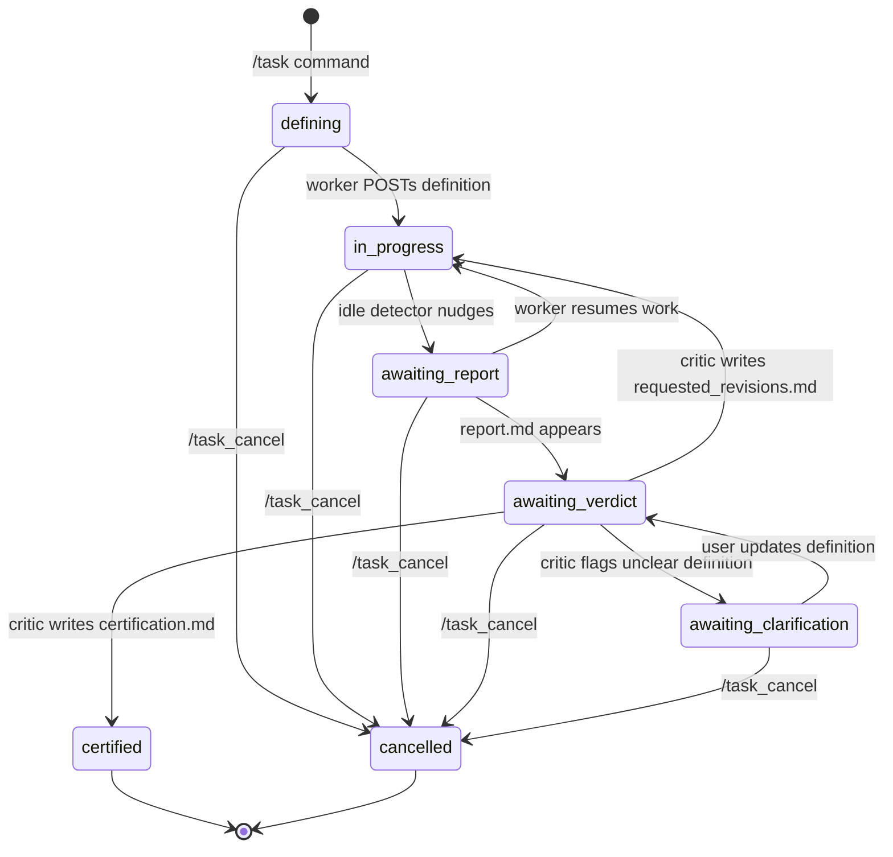
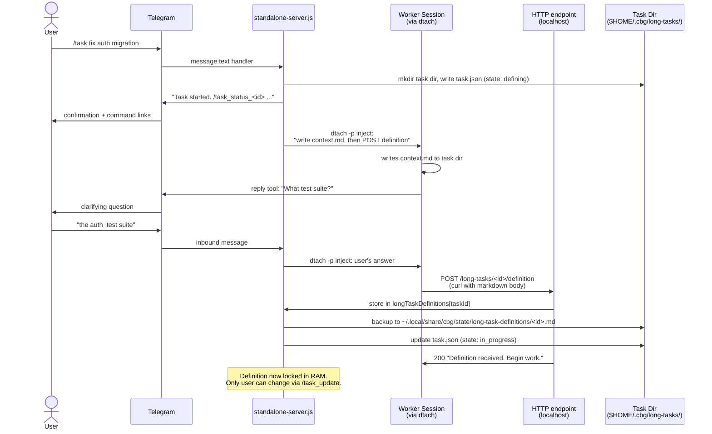
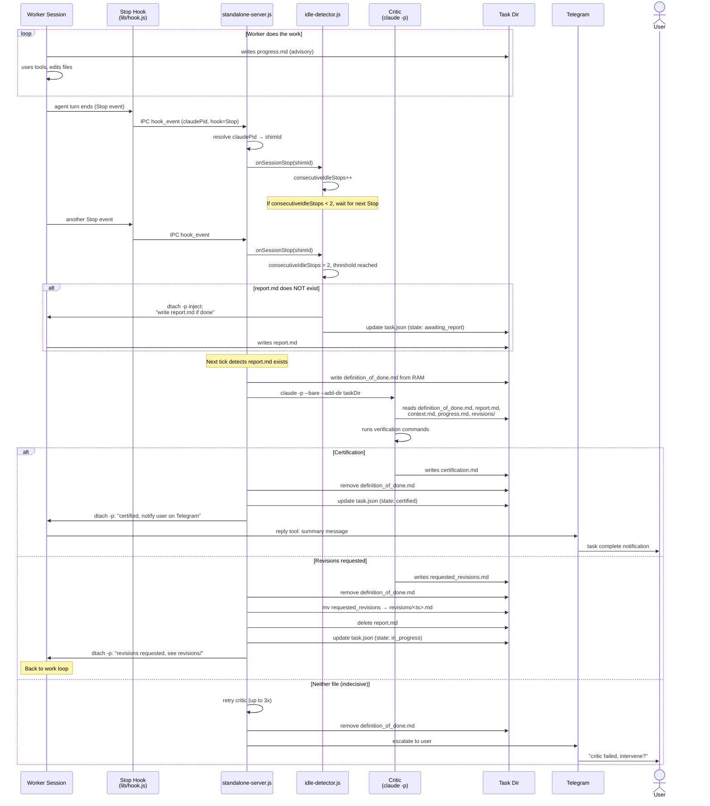
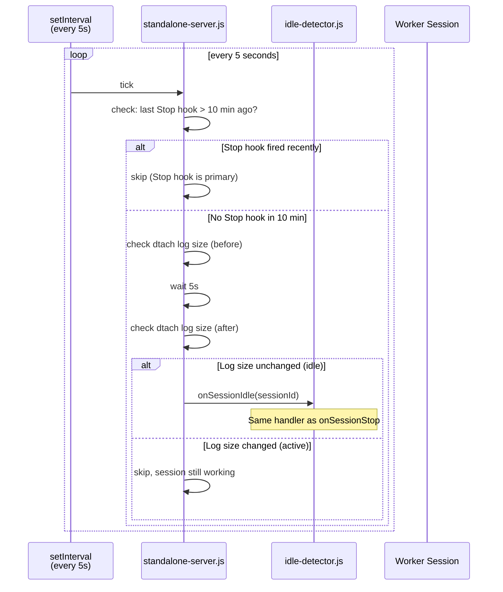
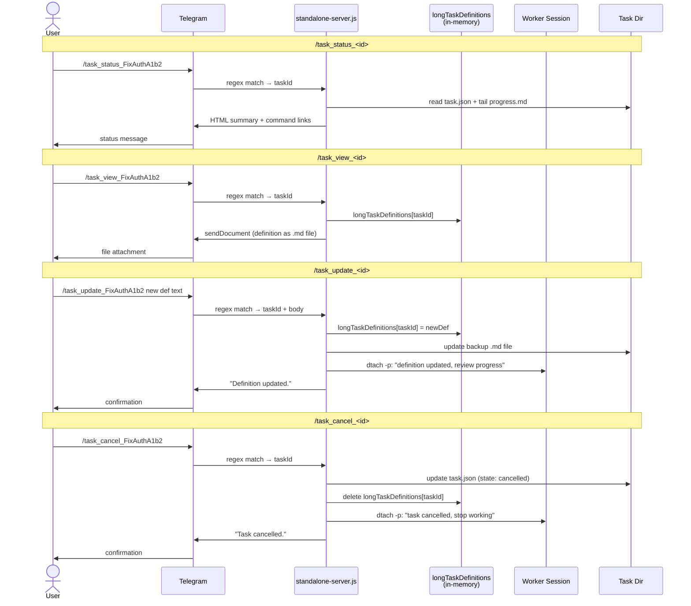

# Long Task — Design Plan

A subsystem for **long tasks**: work items with a locked definition of
done that the worker cannot retroactively weaken, a stateless critic
that independently judges completion, and file-on-disk state that
survives crashes and session turnover.

## Non-goals

- Scheduled events, watchers, callback-driven events — separate systems.
- Persistent/stateful critic sessions.
- Worker access to the definition of done after submission.

---

## Core design principle: the worker cannot edit the definition

The worker **authors** the definition of done upfront (before starting
work) by POSTing it to an HTTP endpoint on the standalone server.
The server stores it **in a JS variable** (`longTaskDefinitions[taskId]`).
It is never written to disk during normal operation — it only
materializes as a file right before the critic runs, and is removed
immediately after.

This prevents the most dangerous shirk pattern: the worker does 80% of
the work, realizes the last 20% is hard, and retroactively weakens the
definition to match what it already did.

The worker already knows the definition (it wrote it), so the critic
is free to reference it in revision feedback. The protection is
against **modification**, not secrecy.

---

## Diagrams

### State machine



### Task creation & definition locking



### Work → idle detection → critic loop



### Time-based idle fallback



### User management commands



### ID and data residence

```mermaid
flowchart TB
    subgraph Telegram["Telegram"]
        chatId["chat_id: 688903965"]
        msgId["message_id (per message)"]
    end

    subgraph Server["standalone-server.js (long-lived)"]
        sessions["sessions Map<br/>key: shimId (calmLion)<br/>val: { conn, info: { pid, cwd, dtachSocket } }"]
        focused["focusedSessionId: calmLion"]
        taskDefs["longTaskDefinitions Map<br/>key: taskId<br/>val: markdown string"]
        taskIndex["sessionToTaskId Map<br/>key: shimId<br/>val: taskId"]
        pidMap["pidToShimSession Map<br/>key: claudePid<br/>val: shimId"]
    end

    subgraph Disk["Filesystem"]
        taskJson["task.json<br/>{ id, state, worker.sessionId,<br/>worker.dtachSocket,<br/>createdBy.chatId }"]
        taskFiles["context.md, progress.md,<br/>report.md, certification.md,<br/>revisions/"]
        defBackup["~/.local/share/cbg/state/<br/>long-task-definitions/<id>.md<br/>(cold backup only)"]
    end

    subgraph Worker["Worker Session"]
        shimId["shim session ID: calmLion"]
        claudePid["claude PID: 48291"]
        dtach["dtach socket path"]
    end

    subgraph Critic["Critic (ephemeral)"]
        criticFiles["sees only: taskDir/<br/>definition_of_done.md (transient)<br/>+ context/report/progress/revisions"]
    end

    chatId -->|stored at creation| taskJson
    shimId -->|registered via IPC| sessions
    claudePid -->|Stop/PreTool hooks| pidMap
    pidMap -->|resolved to| sessions
    sessions -->|dtachSocket lookup| dtach
    taskDefs -->|written transiently<br/>before critic call| criticFiles
    taskDefs -->|backed up| defBackup
    defBackup -->|restored on restart| taskDefs
    taskIndex -->|O(1) lookup on<br/>Stop hook| taskJson
```

---

## Full flow

### 1. User creates a task

```
user on Telegram: /task fix the auth migration so all tests pass
```

The server:
- Generates an id (PascalCase slug + 4 hex chars, e.g. `FixAuthMigrationA1b2`).
- Creates the task directory at `$HOME/.cbg/long-tasks/<id>/`.
- Writes initial `task.json` with state `defining`.
- Responds on Telegram:

  ```html
  Task started.

  /task_status_FixAuthMigrationA1b2 — check status
  /task_view_FixAuthMigrationA1b2 — view definition of done
  /task_update_FixAuthMigrationA1b2 — modify the definition
  /task_cancel_FixAuthMigrationA1b2 — cancel the task
  ```

- Sends a message to the **focused worker session** via dtach stdin:

```
The user would like to start a long task (id: FixAuthMigrationA1b2).

User's request:
> fix the auth migration so all tests pass

First, write a context.md file to $HOME/.cbg/long-tasks/FixAuthMigrationA1b2/context.md
describing the current state of things: the PWD, relevant files, branch,
any important context that would help someone unfamiliar understand the
situation. This file will be shared with reviewers who have no other context.

Then, confirm that a sufficient definition of done can be created from
the user's request. Ask clarifying questions via Telegram but don't
bike-shed — the definition should be concrete and falsifiable but
doesn't need to be exhaustive.

As soon as no clarifications are needed, POST your definition of done
(as a markdown document) to:
  http://localhost:<port>/long-tasks/FixAuthMigrationA1b2/definition

Use Bash with curl:
  curl -s -X POST http://localhost:<port>/long-tasks/FixAuthMigrationA1b2/definition \
    -H "Content-Type: text/markdown" \
    --data-binary @- <<'DEFINITION'
  <your definition here>
  DEFINITION

The server will confirm receipt. Then begin work:
- Write progress notes to $HOME/.cbg/long-tasks/FixAuthMigrationA1b2/progress.md
- When done, write $HOME/.cbg/long-tasks/FixAuthMigrationA1b2/report.md
  (a critic will review it independently — the report.md will be read
  WITHOUT your conversation context, so include the PWD, branch, what
  changed, and concrete evidence like test output or git log)

<user_prompt>
fix the auth migration so all tests pass
</user_prompt>
```

### 2. Worker drafts the definition

The worker:
1. Writes `context.md` describing the PWD, repo state, relevant files.
2. May ask the user clarifying questions via Telegram reply tool.
3. When ready, POSTs the definition to the HTTP endpoint.

The user can view and edit the definition at any time via
`/task_update_<id>` on Telegram.

### 3. Server locks the definition

The HTTP handler (in `standalone-server.js`):
- Validates the task id exists and state is `defining`.
- Stores the definition in memory: `longTaskDefinitions[taskId] = body`
- Updates `task.json`: state → `in_progress`.
- Returns `200 OK` with body: `Definition received. Begin work.`

From this point, the definition is untouchable by the session. Only
the user can change it via `/task_update_<id>`.

On server restart, definitions are lost from RAM. To survive restarts,
the server writes a backup copy to
`$HOME/.local/share/cbg/state/long-task-definitions/<id>.md` and
reloads it on startup. This file is outside the task directory and is
never referenced in any prompt to the worker. It's purely a
persistence mechanism.

### 4. Worker does the work

The worker writes to `progress.md` as it goes (advisory, for
debugging). When it believes the definition is met, it writes
`report.md` summarizing what it did and why each criterion is met.

The report.md is read by the critic **without any conversation
context**, so the worker is instructed to include:
- The PWD and branch where changes were made
- What files were changed and why
- Concrete evidence (test output, git log, command results)
- How each criterion from the definition is satisfied

### 5. Idle detection → done-check nudge

When the idle detector fires (Stop hook or 10-min fallback) and the
active task is `in_progress`:

- If `report.md` **does not exist**: inject via dtach:

  ```
  [long task FixAuthMigrationA1b2]
  If you are done, please write
  $HOME/.cbg/long-tasks/FixAuthMigrationA1b2/report.md
  summarizing what you accomplished and why each requirement is met.
  Include the PWD, branch, files changed, and concrete evidence —
  the reviewer has no other context.
  If you are not done, please continue working, logging progress to
  $HOME/.cbg/long-tasks/FixAuthMigrationA1b2/progress.md, and
  write report.md when done.
  ```

- If `report.md` **exists**: advance to step 6.

### 6. Critic runs

The server:
1. Writes `longTaskDefinitions[taskId]` to the task dir as
   `definition_of_done.md`.
2. Spawns the critic (see "Critic" section below).
3. After the critic exits, **removes** `definition_of_done.md` from
   the task dir (in a `finally` block).
4. Processes the verdict.

### 7a. Critic says YES → `certification.md`

- State → `certified`.
- Inject to worker via dtach:

  ```
  [long task FixAuthMigrationA1b2 — certified]
  The critic has certified this task as complete. Please notify the
  user on Telegram with a short summary of what was accomplished.
  ```

- Worker uses its Telegram reply tool to send the user a message.

### 7b. Critic says NO → `requested_revisions.md`

- Rename `requested_revisions.md` →
  `revisions/requested_revisions.<iso-ts>.md`.
- Delete `report.md` (worker must write a fresh one).
- State → `in_progress`.
- Inject to worker via dtach:

  ```
  [long task FixAuthMigrationA1b2 — revisions requested]
  The critic reviewed your report.md but said it didn't meet the
  definition of done. Look at
  $HOME/.cbg/long-tasks/FixAuthMigrationA1b2/revisions/requested_revisions.<ts>.md
  for details. Address each item, then write a new report.md
  (remember: include PWD, branch, evidence — reviewer has no context).
  ```

### 7c. Critic produces neither file

- Retry up to 3 times with a sharper prompt.
- After 3 failures, escalate to user on Telegram.

---

## Directory layout

```
$HOME/.cbg/long-tasks/<id>/
    task.json
    context.md                     # worker-authored at task start
    progress.md                    # worker-authored (advisory)
    report.md                      # worker-authored (triggers critic)
    certification.md               # critic-authored (terminal)
    revisions/
        requested_revisions.<ts>.md
    critic.log                     # JSONL audit trail
    worker.log                     # JSONL of nudges delivered
```

Definition of done is stored **in server RAM**
(`longTaskDefinitions[taskId]`) with a cold backup at
`$HOME/.local/share/cbg/state/long-task-definitions/<id>.md` for
restart recovery only. Never in the task directory except transiently
during critic calls.

**File retention:** All task directories and their contents are kept
permanently, including terminal tasks (`certified`, `cancelled`).
Nothing is auto-deleted. The history is useful for viewing, debugging,
and as memory for future sessions. Users can manually `rm -rf` a task
dir if they want it gone.

---

## The HTTP endpoint

The standalone server adds a minimal `Deno.serve` HTTP listener on
`localhost:<port>` (configurable, default `19541`, bound to `127.0.0.1`
only — never `0.0.0.0`).

```
POST /long-tasks/<id>/definition
    Content-Type: text/markdown
    Body: the definition of done as markdown

    → 200 "Definition received. Begin work."
    → 400 "Task <id> not found" / "Task is not in 'defining' state"
    → 409 "Definition already submitted for this task"

GET /long-tasks/<id>/status
    → 200 JSON: { id, state, hasReport, hasRevisions, hasContext }
```

The port is written to `$HOME/.local/share/cbg/state/long-task-http.port`
so the task creation prompt can embed it.

No auth needed for v1 (localhost only, single-user machine).

---

## The critic

Stateless, one-shot `claude -p`. Every invocation is fresh — no
resumed sessions, no memory of prior rounds. The critic sees only
the files in the task dir at call time.

### Invocation

```bash
claude -p \
    --model "$CRITIC_MODEL" \
    --fallback-model "$CRITIC_FALLBACK_MODEL" \
    --bare \
    --no-session-persistence \
    --add-dir "$taskDir" \
    --allowed-tools "$CRITIC_ALLOWED_TOOLS" \
    --max-budget-usd "$CRITIC_MAX_BUDGET_USD" \
    "$prompt"
```

### What the critic sees in `$taskDir` at call time

```
definition_of_done.md     ← written by server from RAM moments ago
context.md                ← written by worker at task start
report.md                 ← written by worker
progress.md               ← written by worker (advisory)
revisions/                ← prior revision history (if any)
```

### Critic prompt

```
You are the critic for a long-running task. Your job is to
independently judge whether the worker's report satisfies the
definition of done. You have file access to this task's directory.

The worker wrote the definition of done before starting work and
cannot modify it now. They submitted a report claiming the work is
complete. Your job is to verify that claim against the locked
definition.

Read these files:
  - definition_of_done.md — the locked definition of done
  - context.md — the worker's description of the starting state
  - report.md — the worker's claim of completion with evidence
  - progress.md — the worker's notes (may be incomplete)
  - revisions/ — any prior revision requests and outcomes

You have tool access to verify claims in the report. Run commands
if the report cites test results, git state, or file contents —
trust evidence you gather yourself over the worker's claims.

Do your best with the definition you have, even if it's vague.
A vague definition still means something — use your judgment.

You MUST produce EXACTLY ONE of these files:
  - certification.md — if the done condition is clearly and fully
    satisfied. Include a checklist mapping each criterion to
    concrete evidence you verified.
  - requested_revisions.md — if anything is unclear, incomplete,
    shortcuts were taken, or evidence is weak. List concrete items
    the worker must address. Be specific about what's missing.

Shirk signals to watch for:
  - "pre-existing failure" / "was already broken"
  - skipped or xfailed tests
  - TODO / FIXME / HACK comments in new code
  - "good enough" / "works for now" / "out of scope"
  - Evidence that references commands not actually run

Do not produce both files. Do not produce neither.
```

### After the critic returns

| Outcome                                         | Action                                                                                                                           |
| ------------------------------------------------ | -------------------------------------------------------------------------------------------------------------------------------- |
| `certification.md` exists                        | Remove `definition_of_done.md` from task dir; state → `certified`; inject notification to worker.                                |
| `requested_revisions.md` exists                  | Remove `definition_of_done.md`; rename revisions; delete report.md; inject revision message to worker; state → `in_progress`.    |
| Both exist                                       | Anomaly. Remove cert, treat as revisions. Log loudly.                                                                            |
| Neither exists                                   | `indecisiveRetries++`. If < 3, re-spawn with sharper prompt (definition still on disk). If ≥ 3, remove def, escalate to user.    |
| `requested_revisions.md` has `<!-- clarification_needed -->` | Remove def from task dir. Don't deliver to worker. Send to user on Telegram; state → `awaiting_clarification`.          |

Append to `critic.log` after every call.

---

## Idle detection

Dual-signal, reusable module.

### Stop hook (primary)

Registered in `~/.claude/settings.json` during onboarding, same
pattern as PreToolUse/PostToolUse. The only change to
`ensureSettingsJson` is adding `"Stop"` to the hook event loop:

```js
for (const event of ["PreToolUse", "PostToolUse", "Stop"]) {
```

Same `run/hook` script, same `lib/hook.js`, same IPC path. Server
adds a branch in `handleHookEvent`:

```js
if (msg.hook === "Stop") {
    idleDetector.onSessionStop(msg.sessionId)
    return  // Stop hooks don't get Telegram status messages
}
```

### Time-based fallback (10 min)

Existing dtach-log-size watchdog refactored into `lib/idle-detector.js`.
Only fires if no Stop hook has been seen for the session in 10 minutes.
Covers broken hooks, `--bare` sessions, infinite tool loops.

### Reusable `lib/idle-detector.js`

Two signal inputs, pluggable handlers:
- Handler 1: existing Telegram-reply nudges (current behavior preserved).
- Handler 2: long-task done-check nudges.

### Nudge logic for long tasks

1. Only nudge the session's task (at most one non-terminal task per session).
2. Only in `in_progress` or `awaiting_report` states.
3. After `N` consecutive idle signals (default 2) without worker
   output between them.
4. Inject done-check prompt via dtach.
5. Escape valve: after 5 nudge cycles with no report.md and no
   progress.md updates, escalate to user on Telegram.

---

## One active task per session

A session can have **at most one non-terminal task** at a time. To
start a new task, the existing task must be in a terminal state
(`certified`, `cancelled`, or `abandoned`).

### Guards

**`/task` command** checks for an active task on the focused session
before creating a new one:

```js
const existing = findActiveTaskForSession(focusedSessionId)
if (existing) {
    await ctx.reply(
        `Session already has an active task: ${existing.id} (${existing.state}).\n`
        + `Use /task_cancel_${existing.id} or complete it first.`
    )
    return
}
```

**HTTP POST `/long-tasks/<id>/definition`** also validates that the
session isn't somehow bound to a second task (defensive — the Telegram
guard should catch this first).

This keeps the model simple: one session, one task, one set of nudges.
No priority decisions, no confusion about which task a nudge is for.

---

## Dynamic commands: `/task_status_<id>` and `/task_update_<id>`

These follow the same pattern as `/chat_<id>` and `/switch_<id>` —
handled via regex matching in `bot.on("message:text")` in
`standalone-server.js`, before the hot-reloadable command dispatch.

```js
// /task_status_<id>
const taskStatusMatch = /^\/task_status_(\w+)/i.exec(text)
if (taskStatusMatch) {
    const taskId = taskStatusMatch[1]
    // ... load task.json, format status, reply ...
}

// /task_update_<id> <new definition or instructions>
const taskUpdateMatch = /^\/task_update_(\w+)\s+([\s\S]+)/i.exec(text)
if (taskUpdateMatch) {
    const taskId = taskUpdateMatch[1]
    const newDef = taskUpdateMatch[2]
    // ... update longTaskDefinitions[taskId], backup to disk,
    //     notify worker via dtach ...
}
```

### `/task_status_<id>`

Replies with an HTML-formatted summary:

```html
<b>Task: FixAuthMigrationA1b2</b>
State: in_progress
Session: calmLion (active)
Created: 2026-04-11
Critic calls: 2
Last nudge: 5 min ago

<b>Progress (last 5 lines):</b>
<pre>- migrated token_refresh table
- updated auth middleware
- 3 tests still failing in suite B</pre>

/task_update_FixAuthMigrationA1b2
```

Includes the definition of done if the user wants to review it,
plus the tail of progress.md.

### `/task_update_<id>`

Two modes:
1. `/task_update_<id>` (no body) — shows current definition, prompts
   user to reply with a new one.
2. `/task_update_<id> <new definition>` — replaces the locked
   definition in RAM (and backup on disk). Notifies the worker via
   dtach: "The user has updated the definition of done. Review your
   progress and adjust." Does NOT reset state — the worker continues
   from where it is.

### `/task_view_<id>`

Sends the definition of done as a `.md` file attachment on Telegram
(using `sendDocument`). This lets the user read the full definition
in a proper viewer without it getting mangled by Telegram's text
formatting.

```js
const taskViewMatch = /^\/task_view_(\w+)/i.exec(text)
if (taskViewMatch) {
    const taskId = taskViewMatch[1]
    const def = longTaskDefinitions[taskId]
    if (!def) { await ctx.reply("No definition found for that task."); return }
    const tmpPath = join(tmpDir, `${taskId}-definition.md`)
    Deno.writeTextFileSync(tmpPath, def)
    await ctx.replyWithDocument(new InputFile(tmpPath, `${taskId}-definition-of-done.md`))
    try { Deno.removeSync(tmpPath) } catch (e) { dbg("TASK", "tmp cleanup:", e) }
}

// /task_cancel_<id>
const taskCancelMatch = /^\/task_cancel_(\w+)/i.exec(text)
if (taskCancelMatch) {
    const taskId = taskCancelMatch[1]
    // ... load task.json, set state → "cancelled",
    //     delete longTaskDefinitions[taskId],
    //     inject to worker: "[long task <id> — cancelled] The user has
    //       cancelled this task. Stop working on it.",
    //     reply on Telegram: "Task <id> cancelled." ...
}

---

## State machine

(See mermaid state diagram in [Diagrams](#diagrams) section above.)

Full states:
- **defining** — worker is drafting context.md and the definition;
  hasn't submitted yet.
- **in_progress** — definition locked, worker is working.
- **awaiting_report** — worker nudged to write report.md.
- **awaiting_verdict** — report.md exists, critic running.
- **awaiting_clarification** — critic asked user to clarify definition.
- **certified** — terminal.
- **cancelled** — terminal. User-triggered via `/task_cancel_<id>`
  from any state. The only way to unblock a session for a new task
  besides certification.

---

## `task.json`

```jsonc
{
    "id": "FixAuthMigrationA1b2",
    "title": "Fix auth migration",
    "originalPrompt": "fix the auth migration so all tests pass",
    "createdAt": "2026-04-11T05:36:00Z",
    "createdBy": { "chatId": "688903965" },

    "worker": {
        "sessionId": "calmLion",
        "cwd": "/Users/jeff/repos/x",
        "dtachSocket": "/path/to/dtach-calmLion.sock"
    },

    "state": "in_progress",

    "nudge": {
        "lastStopAt": null,
        "lastNudgeAt": null,
        "consecutiveIdleStops": 0,
        "totalNudges": 0
    },

    "critic": {
        "callCount": 0,
        "lastCallAt": null,
        "indecisiveRetries": 0
    }
}
```

---

## Session and chat ID flow

No structural changes to the existing session/chat storage are needed.
Here's how IDs flow through each layer and why the existing
infrastructure is sufficient.

(See mermaid "ID and data residence" diagram in [Diagrams](#diagrams)
section above for a visual overview.)

### Key observations

**Stop hook session resolution.** The `session_id` in Claude Code's
hook JSON is Claude Code's internal UUID, NOT the shim's friendly name
("calmLion"). The existing hook system resolves this via PID matching:
`claudePid` → walk `sessions` Map → find shim where `info.pid` matches
→ get shim ID. This is the same mechanism PreToolUse/PostToolUse
already use — Stop hooks go through the identical path. No change
needed.

**dtach socket lookup.** The live `sessions` Map is the source of truth
for dtach sockets. When injecting to a worker, always prefer
`sessions.get(task.worker.sessionId)?.info.dtachSocket` over the
value saved in task.json. The task.json value is a fallback for the
brief window during session restart before the new shim registers.
If both are unavailable, the injection fails loudly (as planned).

**Telegram chat_id.** Available from `ctx.chat.id` at `/task` creation
time. Stored in `task.json.createdBy.chatId`. Used for escalation
messages ("task idle 5 nudges — intervene?") and certification
notifications. `bot.api.sendMessage(chatId, text)` works directly.

**HTTP endpoint needs no session ID.** The worker identifies itself by
task ID in the URL (`/long-tasks/<taskId>/definition`). The server
validates the task exists and is in the right state. No session
awareness needed on the HTTP side.

### In-memory index: `sessionToTaskId`

To avoid scanning all task dirs on every Stop hook event, maintain an
in-memory map in `lib/long-task.js`:

```js
const sessionToTaskId = new Map()  // sessionId → taskId (non-terminal only)
```

Built from disk scan on server startup. Updated on task create, cancel,
certify, and session rebind. The idle detector calls
`getTaskForSession(sessionId)` which is an O(1) lookup into this map
instead of an O(n) directory scan.

---

## Session rebinding

When a session dies, its tasks stay on disk. When a new session
registers in the same cwd, the server prompts the user on Telegram:
"Task `<id>` was bound to `calmLion`. Rebind to `happyFox`?"

On rebind, the server re-injects the task context to the new session
via dtach:

```
[long task FixAuthMigrationA1b2 — resuming]
You are continuing a long task started by a previous session.
- Context: $HOME/.cbg/long-tasks/<id>/context.md
- Progress notes: $HOME/.cbg/long-tasks/<id>/progress.md
- Prior revisions (if any): $HOME/.cbg/long-tasks/<id>/revisions/
When done, write $HOME/.cbg/long-tasks/<id>/report.md.
Include PWD, branch, files changed, and evidence — the reviewer
has no other context.
```

The new session does NOT get the definition of done. It works from
context.md, progress notes, and revision history.

---

## Commands

Telegram-facing (hot-reloadable in `commands/task.js`):

- `/task <description>` — create task, send definition-drafting
  prompt to focused session. Rejects if session already has an
  active task.
- `/task_list` — show all tasks and their states.
- `/task_show <id>` — dump task.json + definition + tail of critic.log.

Dynamic commands (regex-matched in `standalone-server.js`, same
pattern as `/chat_<id>`):

- `/task_status_<id>` — show state, progress tail, definition.
- `/task_update_<id> [new definition]` — view or replace the locked
  definition. User-only.
- `/task_view_<id>` — send the definition of done as a `.md` file
  attachment on Telegram.
- `/task_cancel_<id>` — terminal. Cancels the task regardless of
  state. Notifies the worker via dtach that the task has been
  cancelled. User-only.

---

## Configuration

```yaml
longTask:
    httpPort: 19541
    dir: ~/.cbg/long-tasks
    critic:
        model: claude-sonnet-4-6
        fallbackModel: claude-haiku-4-5-20251001
        maxBudgetUsdPerCall: 0.50
        allowedTools: "*"
        maxIndecisiveRetries: 3
    nudge:
        quietStopsBeforeNudge: 2
        fallbackIdleMinutes: 10
        maxNudgesBeforeEscalate: 5
```

### Onboarding additions

New step: critic permission prompt. Stored in
`longTask.critic.allowedTools`. Options: all permissions / read-only /
custom pattern.

---

## File / module inventory

New files:
- `lib/idle-detector.js` — reusable idle detection, dual-signal,
  pluggable handlers.
- `lib/long-task.js` — task dir ops, slug generation, task.json CRUD,
  state derivation, active-task management, definition RAM store +
  disk backup/restore.
- `lib/long-task-critic.js` — critic subprocess spawn, prompt assembly,
  definition write/remove around critic call, output parsing, retry.
- `lib/long-task-http.js` — `Deno.serve` handler for
  `/long-tasks/<id>/definition` and `/long-tasks/<id>/status`.
- `commands/task.js` — `/task`, `/task_list`, `/task_show`
  Telegram commands.

Touched files:
- `standalone-server.js` — start HTTP listener; add
  `/task_status_<id>` and `/task_update_<id>` regex handlers in
  `bot.on("message:text")`; refactor nudge watchdog into
  idle-detector; add Stop hook branch in `handleHookEvent`; wire
  long-task subsystem; restore definitions from disk backup on startup.
- `lib/onboard.js` — add `"Stop"` to hook events in
  `ensureSettingsJson` and `removeFromSettingsJson`; add critic
  permission step.
- `lib/config.js` — defaults for `longTask.*`.

---

## Failure modes

| Failure                                        | What happens                                              | Mitigation                                                            |
| ---------------------------------------------- | --------------------------------------------------------- | --------------------------------------------------------------------- |
| Worker never submits definition                | State stays `defining`                                    | After 10 min, nudge via dtach "please submit your definition"         |
| Worker never writes context.md                 | Critic has less context                                   | Non-blocking; critic does its best                                    |
| Worker submits definition twice                | HTTP returns 409 Conflict                                 | One submission per task; update is user-only                          |
| Server restarts (definitions lost from RAM)    | Restored from disk backup on startup                      | Backup written on every definition store/update                       |
| Disk backup missing after restart              | Definition gone; task stuck                               | Escalate to user; they can re-provide via `/task_update_<id>`         |
| Worker tries to find definition on disk        | Backup at unpredictable path, never referenced in prompts | Soft guardrail — worker would have to actively snoop                  |
| Worker writes report.md before definition      | State is `defining`, report.md ignored                    | Nudge: "submit your definition first"                                 |
| Critic writes neither file                     | Retry up to 3 times                                       | Escalate to user on Telegram                                          |
| Session dies before submitting definition      | Task stuck in `defining`                                  | On rebind, re-inject the definition-drafting prompt                   |
| HTTP port conflict                             | `Deno.serve` fails to bind                                | Log error, try next port, write actual port to state file             |
| definition_of_done.md not removed after critic | Worker could read it                                      | Remove in `finally` block; startup sweep deletes stranded copies      |
| No dtach socket for worker                     | Cannot inject messages                                    | Fail loudly. All sessions must run under dtach.                       |
| `/task` while session has active task           | Rejected                                                  | Guard: "cancel or complete existing task first"                       |
| User edits definition via `/task_update_<id>`  | RAM + backup updated; worker notified                     | Logged in critic.log                                                  |
| report.md is empty or garbage                  | Critic handles it — writes requested_revisions            | No special case needed                                                |

---

## Implementation order

1. `lib/idle-detector.js` — reusable module, unit-testable.
2. Stop hook registration — add `"Stop"` to `ensureSettingsJson`.
   Add `handleHookEvent` branch. Verify Stop events arrive.
3. Refactor nudge watchdog to use idle-detector. Existing behavior
   preserved.
4. `lib/long-task.js` — task dir ops, task.json CRUD, state
   derivation, active-task management, definition RAM store, disk
   backup/restore.
5. `lib/long-task-http.js` — `Deno.serve` on `127.0.0.1`. POST
   definition, GET status. Test with curl.
6. `commands/task.js` — `/task` (with active-task guard),
   `/task_list`, `/task_show`.
7. Dynamic command handlers in `standalone-server.js` —
   `/task_status_<id>`, `/task_update_<id>`, `/task_view_<id>`,
   `/task_cancel_<id>`. Follows `/chat_<id>` pattern.
8. Long-task handler in idle-detector — done-check nudges, report.md
   detection.
9. `lib/long-task-critic.js` — definition write/remove around critic
   call, prompt assembly, output parsing, retry.
10. Full end-to-end: `/task` → context.md → definition → work →
    report → critic → certification or revision → re-report →
    certification.
11. Onboarding: critic permission step.
12. Session rebinding.
13. Failure shakedown: skip definition, submit twice, kill worker
    mid-report, kill critic mid-call, corrupt task.json, try `/task`
    while active task exists (should reject), `/task_cancel` mid-critic,
    race report.md write during critic call, verify
    definition_of_done.md is always cleaned up, restart server and
    verify definition restored from backup.
